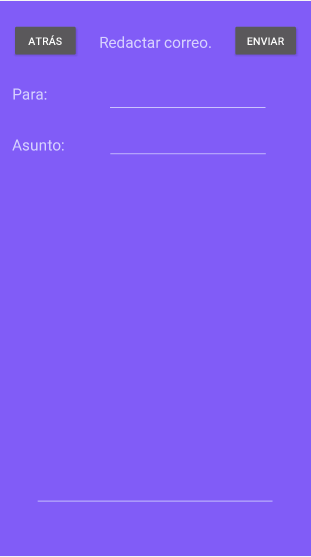
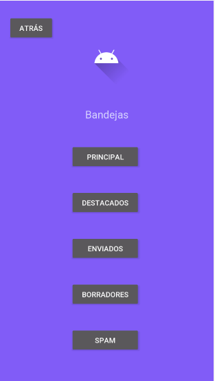

# Proyecto 1 de Android 📱

### Integrantes

- Alvarez Loran Juan Pablo 
- Barreiro Valdez  Alejandro  
- Chilpa Navarro Martín Enrique  
- Espinosa Guadarrama Arturo  
- Flores Salinas Ana Paula  
- Lagunas Parra Ana Paola  
- Zarco Muñoz Gabriel

___

# Objetivo de la app

  El principal objetivo de esta aplicación es poder aplicar cada uno de los conocimientos adquiridos en el curso de Android, empleando 
  para ello el lenguaje de programación Kotlin al igual que los servicios online de base de datos y funciones analíticas de Firebase. 

___

# Finalidad de la app

  Esta aplicación tendrá como finalidad servir como un servicio de mensajería en el cual se pueda enviar y recibir correos electrónicos 
  de una cuenta registrada, al igual de contener un menú interactivo para poder navegar entre el servicio de mensajeria, un calendario 
  y una sección de minijuegos (al principio contará solamente con el juego del gato).

___

# Secciones que contiene la app

## Ventana para redactar un correo  

  Esta ventana le permite al usuario redactar un correo ya que esté autentificado. Contiene dos botones en la parte superior de la pantalla, uno es para volver a la ventana anterior y otro para enviar el correo. También hay tres partes donde el usuario puede ingresar texto. La primera es para escribir el destinatario, la segunda para escribir el asunto del correo y la tercera para escribir el correo. Esta ventana tomó las funcionalidades de la app de Gmail pero es más minimalista.

## Ventana con las bandejas de correo  

  Se puede acceder a las distintas bandejas que ofrece un servicio de mail. En la parte superior tiene un botón para volver a la ventana anterior. En la parte superior de la ventana, en el centro, hay una imagen donde va la foto de perfil del usuario. Debajo de la imagen se listan con botones las bandejas que pueden ser accesadas dentro de la aplicación. Las bandejas son de principal, destacados, enviados, borradores y spam. Se cuentan con las bandejas más esenciales y usadas del correo electrónico.

  
