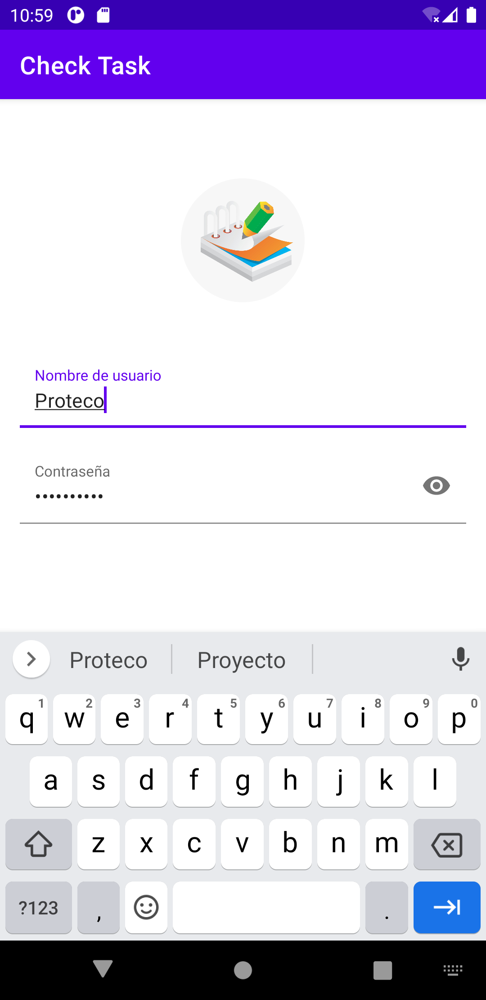

# Proyecto Android-Aspirantes

### Integrantes:  

Galnares Ruiz Diego <br>
García Miranda Athenas <br>
Merino Hernández Ailyn  <br>
# Acerca de esta App.  

Check Task es una aplicación móvil que facilita la administración de tus actividades diarias a través de tu correo.

##  ¿Cómo funciona?  

###  1. Autentificación a través de una cuenta

Regístrate mediante un correo y te notificaremos de tus actividades pendientes.

 

### 2. Detalles de la tarea

Añade un nombre y los detalles de la tarea por hacer.

 

### 3. Tiempo Límite

Check task proporciona un calendario para que el usuario defina una fecha de expiración para la tarea, de esta manera enviaremos un correo al usuario como recordatorio.

 

### 4.  Check Task

¿Terminaste los deberes? Marca las tareas finalizadas y olvídate de los mensajes por correo.

 

### 5. Icono 
Identifica la app con su característico ícono.

 

## Especificaciones   

Check Task es una aplicación que se ejecuta en versiones Marshmallow y posteriores.<br>
Debido a que no se agregó el registro del usuario, este por defecto es Proteco y la contaseña proteco123

## ¿Qué aprendimos con este proyecto?   

### 1. Etiquetas flotantes

Nos ayudaron a optimizar el espacio en los campos de texto para que no se pierda la noción de los datos que se van a ingresar

```kotlin
android:hint="@string/nombre_de_usuario"
android:background="@android:color/transparent"
android:inputType="text"
```
```kotlin
android:hint="@string/nombre_de_usuario"
android:background="@android:color/transparent"
android:inputType="text"
```

### 2. Visibilidad para contraseñas

El atributo passwordtoggleenabled nos ayuda a la visibilidad de la contraseña

```kotlin
<com.google.android.material.textfield.TextInputLayout
  app:passwordToggleEnabled="true"
  android:layout_width="match_parent"
  android:layout_height="wrap_content">
```

### 3. Validación de datos

Usamos una estructura de flujo y la palabra reservada Toast para mostrar mensajes de avisos de datos iválidos

```kotlin
if(!nameLogin.text.toString().equals(User.nameUser)){
            Toast.makeText(this, "Usuario incorrecto", Toast.LENGTH_LONG).show()
        }else if(!passLogin.text.toString().equals(User.pass)){
            Toast.makeText(this, "Contraseña incorrecta", Toast.LENGTH_LONG).show()
        }else{
            startActivity(Intent(this,ListTaskActivity::class.java))
            finish()
        }
```
### 4. Calendarios
El codigo siguiente es para leer la fecha a partir de un calendario, de esta forma las pasamos como parametros a una funcion para la creacion de la tarea.
```kotlin
val c = Calendar.getInstance()
val year = c.get(Calendar.YEAR)
val month = c.get(Calendar.MONTH)
val day = c.get(Calendar.DAY_OF_MONTH)
```

### 5. Agregar tareas
Se creó un modelo "usuario" que tiene como función realizar la inserción de tareas y un modelo Task que es que representa a nuestro item de tareas.<br>
Esta funcion es la encargada de agregar una nueva tarea.
```kotlin
var newTask: Task= Task(nameTask.text.toString(), descTask.text.toString())
newTask.fecha = datePicker?.text.toString()
User.addTask(newTask)
setResult(RESULT_OK)
finish()
```
### 6. Toast
Si el usuarios no llena un campo para crear la tarea, sale un mensaje que indica que ingrese el campo.
```kotlin
if (nameTask.text.toString().isEmpty()){
	Toast.makeText(this,"Ingresa un nombre para la tarea",Toast.LENGTH_SHORT).show()
}else if (descTask.text.toString().isEmpty()){
	Toast.makeText(this,"Ingresa una descripcion para la tarea",Toast.LENGTH_SHORT).show()
}
else if (datePicker.text.toString().isEmpty()){
	Toast.makeText(this,"Ingresa una fecha limite para la tarea",Toast.LENGTH_SHORT).show()
}
```
### 7.CardViev
El apartado de listas se hizo utilizando CardView utilizando margenes para diferenciar cada Card que representa una tarea.<br>
(Dentro del CardView se incluyen otros elementos que acontinuación no son mostrados).
```kotlin
<androidx.cardview.widget.CardView
    xmlns:android="http://schemas.android.com/apk/res/android"
    android:layout_width="match_parent"
    android:layout_marginStart="8dp"
    android:layout_marginEnd="8dp"
    android:layout_marginTop="8dp"
    android:layout_height="100dp">
</androidx.cardview.widget.CardView>

```
### 8.TaskAdapter
Esta función es la encargada de crear el nuevo CardView

```kotlin
override fun onCreateViewHolder(parent: ViewGroup, viewType: Int): ItemTaskViewHolder {
        var view = LayoutInflater.from(parent.context).inflate(R.layout.task_item,parent,false)
        return ItemTaskViewHolder(view)
    }
```

