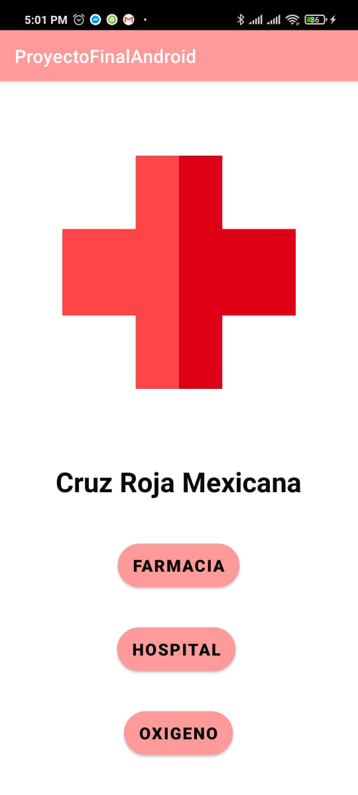
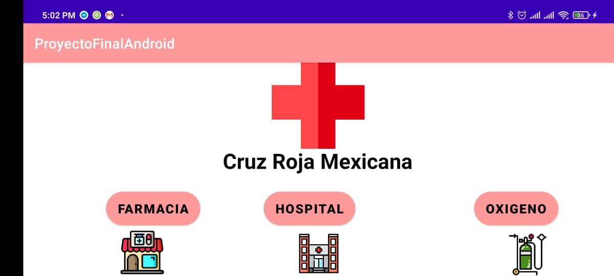

# Proyecto Android.
- García Serrano Héctor Mauricio
- Huarte Nolasco Mario
- Lira Navarro Juan Arturo
- Minero Pineda Erick Rodrigo
- Pérez Delgado Kevin Uriel

## Función.
Debido a la *no* tan reciente pandemia, hemos observado que la necesidad de conocer la localización de ciertos lugares debe ser más rápido y confiable.
La función que desempeña esta aplicación básicamente es mostrar puntos de interés relacionados con la actual pandemia: 
- Farmacias
- Hospitales
- Lugares para conseguir oxígeno.

Con esto, hemos desarrollado una interfaz gráfica agradable con el usuario, solo necesita pulsar el boton de lo que le interesa y lo llevará a otra pantalla para conocer las ubicaciones:

    

Acompañado de su versión en horizontal:

    

Al pulsar el botón deseado, muestra esta pantalla:

    

Posteriormente, al hacer click en "Ver en el mapa" nos llevará a un mapa en tiempo real que nos marcará las ubicaciones de los lugares que se pidió:

    

### Aplicación de lo aprendido en el curso.
Gracias al curso es que pudimos realizar el desarrollo de esta aplicación que aunque es muy básica, tratamos de aplicar la mayoría de los conocimientos adquiridos, desde agregar botones y darles funcionalidad (además de diseño), esto se puede ver en los *activity_main.xml* que contienen las ventanas principales de la aplicación, una en vertical y otra en horizontal. De igual forma hicimos la implementación de texto e imágenes, también en los *activity_main* donde colocamos un título y una imagen de la cruz roja, y en la vista horizontal, también colocamos pequeños íconos alusivos a cada lugar.
En el caso de los mapas que se encuentran en *activity_maps.xml* utilizamos un objeto *Fragment* que controlará dichos mapas, en específico, otro objeto llamado *SupportMapFragment* y así poder mostrar las ubicaciones de los lugares. 
Esta app está desarrollada para Android 7.0 en adelante.
