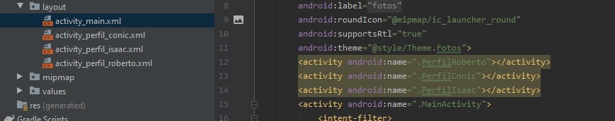
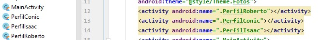
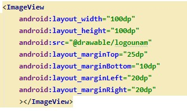
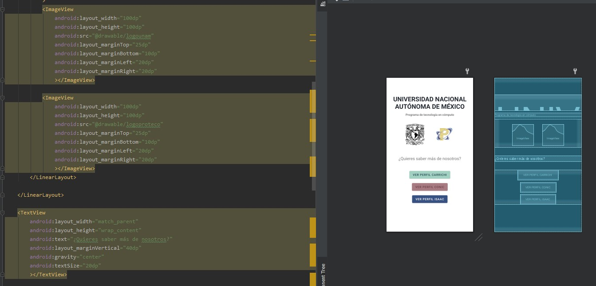
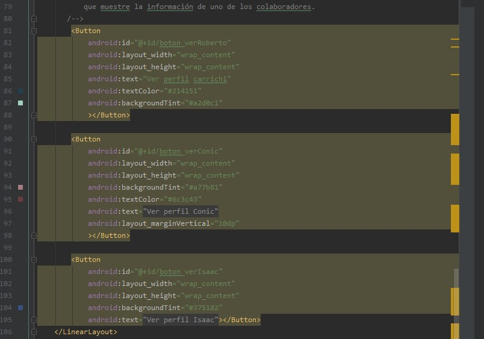
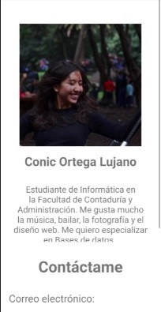

# 🎭 Proyecto Final: "Fotos" - Android

## ✔ Descripción

En nuestro proyecto realizamos una pequeña presentación de los integrantes que la desarrollamos. En la pantalla principal se pueden observar nuestros nombres con botones en dodne se puede acceder a el perfil de cada uno.
Dentro de los perfiles, se encuentra nuestra foto, una pequeña descripción de nuestros gustos y un lik a nuestros perfiles de GitHub. 
Utilizamos API 26: Android 7.0 (Nougat).

## 📲 Conceptos vistos en clase aplicados en el proyecto
-Se crean las actividades del Layout para ser invocadas después en nuestro Main Activity

- Para cada acción realizada dentro de activity.xml es necesario declararlo en el .kt y dentro de AndroidManifest.xml para poder darles funcionalidad a los botones.

- Utilizamos distintos layout para modificar el formato de las imágenes, textos y botones.

- Se utilizaron diferentes layout para editar las propiedades de la TextView, ImageView y LinearLayout.

- Para cada acción realizada dentro de activity.xml es necesario declararlo en el .kt y dentro de AndroidManifest.xml para poder darles funcionalidad a los botones.

Se crean elementos de vista para poner imagenes dentro de nuestras vistas de la aplicación, así como el ajuste de su tamaño, y su ubicación en la vista del dispositivo. 

Creación de botones, así como su descripción visual, su  tamaño y posición en el Layout, su color, y demás características. 

(Para explicar un concepto es requerido también mostrar una captura de pantalla de donde se vea la línea de código en donde se aplica)

## 📸 Capturas de funcionamiento

## 📚 Accesos directos de imporancia

Si es requerido ver la estructura que se implementó para cada una de las actividades, haz click [aquí](app/src/main/res/layout).

Para poder ver el código que le da funcionalidad a las actividades, se encuentra [aquí](app/src/main/java/com/proteco/QuienesSomos_3).

## 🤝 Colaboradores del proyecto

- [Carrichi de la Cruz, Roberto](https://github.com/RobertoCarrichi)
- [Ortega Lujano, Conic](https://github.com/conic-ol)
- [Sanabria Mendoza, Isaac Alejandro](https://github.com/Sportman9x9)