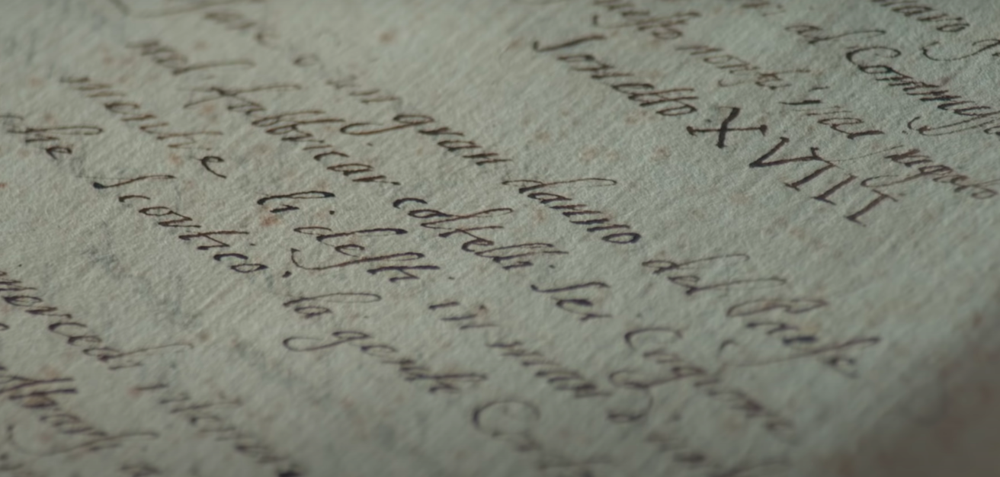
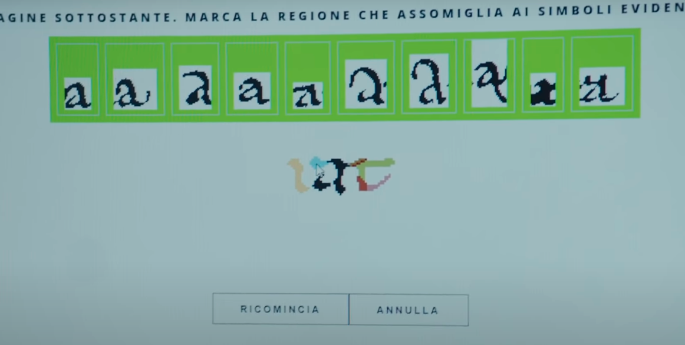
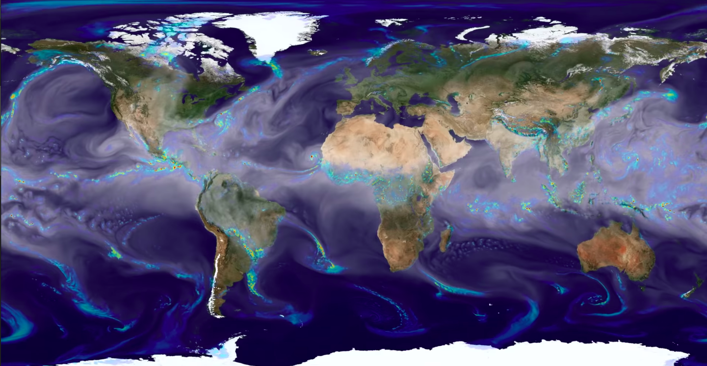
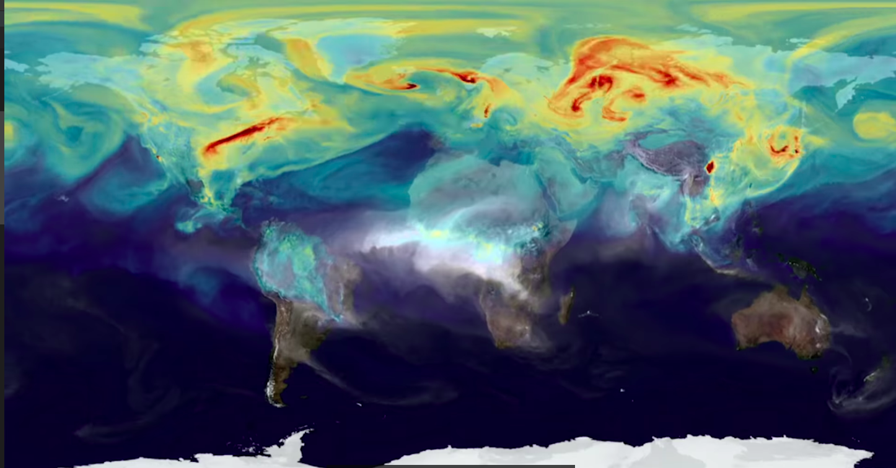
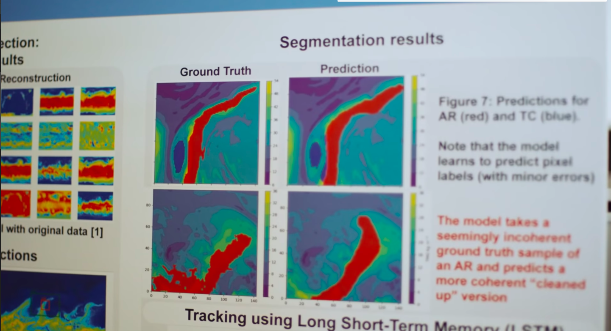
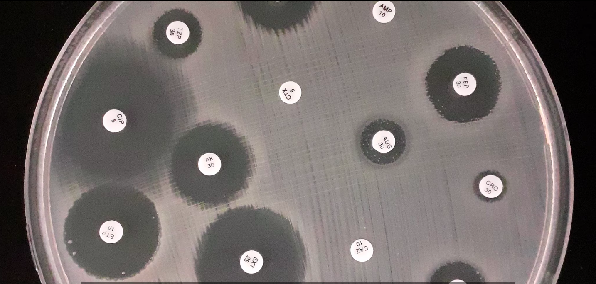
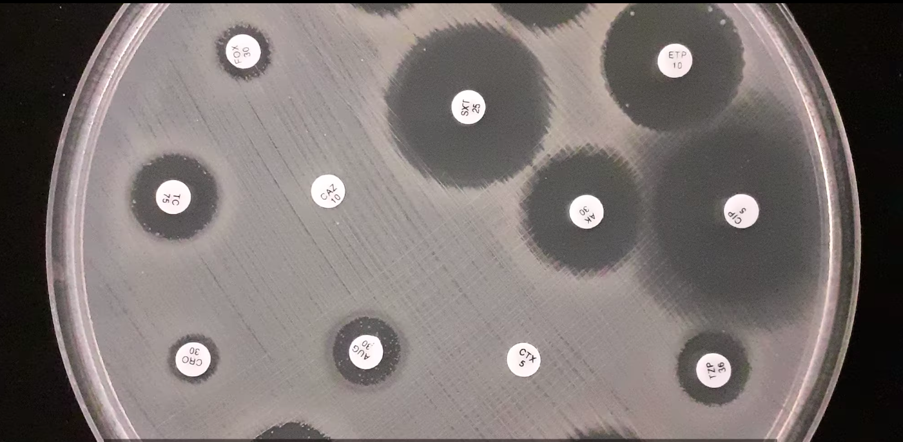
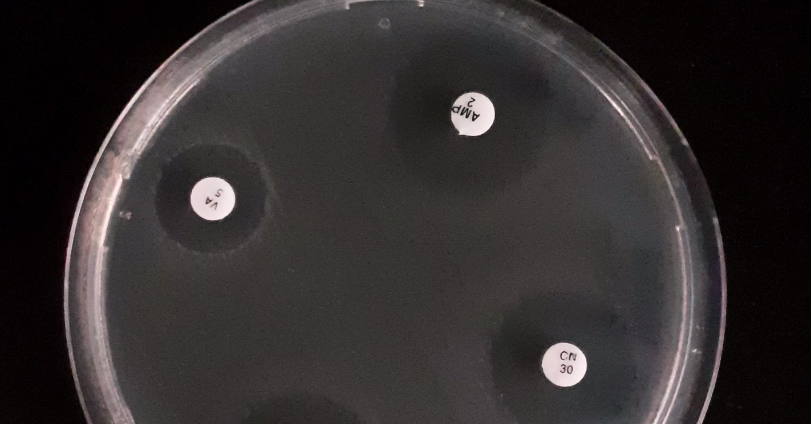
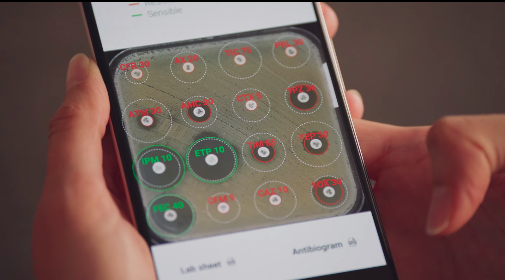

# :computer: Análisis de TensorFlow y qué proyecto harías tu :computer:

## [TensorFlow en archivo vaticano para leer textos antiguos](https://www.youtube.com/watch?v=v-FgOACRgfs&t=37s)

 
Sabemos que la humanidad a generado miles de documentos escritos de mucha información, y una de las principales instituciones que ha escrito textos desde hace muchos años, es por eso que el vaticano tiene más de 80 kilómetros de información almacenada en papel, pero esto es algo malo ya que al estar escrita en papel con tinta, es muy fácil que esta información se pierda, es por ello que la tienen almacenada en lugares en los que tienen control absoluto de todo, desde la cantidad de aire que hay en estos cuartos, la humedad incluso el tiempo de consulta de estos, es por eso que un equipo de profesionales decidieron proponer actualizar la forma en la que se almacena la información, esto digitalmente, pero digitalizar tanto contenido ocuparía mucho tiempo y recursos, aquí es donde entra Tensor Flow ya que con ayuda de inteligencia artificial se intenta lograr la digitalización, pero como creo yo que lo es el proceso que hicieron para lograrlo, bueno investigando más, primero sabemos que se debe de entrenar a la inteligencia artificial a identificar los caracteres que están escritos, una ventaja de que todos estos sean documentos de la iglesia es que la mayoría de estos está escrito con caracteres muy parecidos que son los que enseña la iglesia, por lo que lo que a mi parecer es más difícil es saber hasta donde termina un carácter ya que la mayoría de estos textos están escritos en manuscrita, por lo que en este caso si se empleo un dataset mas grande, pero al final la solución está en transformar las imágenes en matrices, después encontrar los diferentes patrones de colores de cada carácter y al final con ayuda del dataset entrenar a la inteligencia artificial para que encuentre sola los patrones, el problema que se me ocurrio despues de ver el video es como comprobar que lo que identificó la inteligencia artificial sea justo lo que dice el texto, para esto creo que usaron alguna variable para saber que tanto se parece un caracter identificado por la inteligencia artificial con el carácter que realmente es, y los que tengan un menor número de coincidencia son los que un humano tendrá que comprobar, o se podría entrenar a otra inteligencia artificial para que haga la interpretación del texto y así subir el número de coincidencia del carácter 

## [TensorFlow en Berkeley para predecir desastres climáticos](https://www.youtube.com/watch?v=p45kQklIsd4&t=8s&ab_channel=TensorFlow)

Sabemos que hoy en día uno de los principales problemas problemas que existen es el cambio climático y las consecuencias de esto, como cambios muy bruscos de temperatura, o tormentas muy fuertes, básicamente los desastres naturales que se general, que afectan a muchas comunidades del planeta, pero hoy en día con la tecnología que tenemos podemos obtener mucha información de todos estos desastres naturales que se crean y en general del comportamiento del planeta, es por esto que hoy en día usando diferentes tipos de algoritmos y con ayuda de tensor flow, se puede generar estudios de dichos fenómenos para así poder predecir lo mejor posible estos fenómenos y con esto que no generan tantos problemas, o también encontrar patrones para poder evitar de alguna forma que esto pase, es difícil saber cómo funciona por que no es un algoritmo como tal pero la idea es los datos de temperatura por ejemplo que se tengan satelitalmente mandarlo en matrices como siempre y de ahí trabajar con ellas en el algoritmo para intentar predecir un fenómeno

## [TensorFlow en laboratorios para analizar eficiencia de antibióticos](https://www.youtube.com/watch?v=DubGH74k34k&feature=emb_logo)

Médicos sin fronteras es una institución gratuita que se encuentra en más de 70 países ayudando a las comunidades, se han dado cuenta que cada vez existen más casos de personas infectadas con una bacteria resistente a las medicinas, si no se actúa ahora en parar eso, se estima que en 2050 se tendrán 10 millones de muertes al año, para poder darle al paciente un tratamiento primero se debe hacer un análisis de qué tipo de bacteria es y hacer el análisis de resultados de este experimento y después poder saber con pruebas que clase de bacteria es, entonces el problema que aborda este equipo es el poder entrenar a una inteligencia artificial con ayuda de tensor flow para poder hacer la interpretación de los resultados más rápido y fácil, lo que pienso que hicieron es a través de imágenes analizar la interacción entre las bacterias y en antibiótico, y dependiendo de cómo está distribuida esta interacción son los resultados que se tendrán

## [TensorFlow ayudando clientes de Airbnb](https://www.youtube.com/watch?v=tPb2u9kwh2w)

En el video nos presentan el problema de airbnb, el cual es el siguiente, airbnb es una empresa que se encarga de hacer la renta de casas o lugares donde una persona se puede quedar durante un tiempo, al momento de escoger una casa o el lugar donde se hospedaran, lo primero y más importante que se revisa son fotografías de esta, y como tienen alrededor de  millones de casas diferentes en todo el mundo, estas equivalen a tener muchísimas fotos de todas las casas que se encuentran en airbnb.

Es evidente que es necesario tener una forma de poder clasificar las fotografías de cada casa para que sea mucho más fácil a los usuarios escoger alguna casa, es por ello que la propuesta que creo este grupo es poder clasificar las fotografías por zona de la casa a la que esta pertenece, ahora como creo que solucionaron el problema, bueno primero el set de datos, este al parecer fue seleccionado por este grupo de personas y fueron analizando y seleccionando las fotos para el entrenamiento de la inteligencia artificial, pero el programa creo que funciona de la siguiente manera, primero el algoritmo se va a encargar de pasar toda la información de las imágenes en matrices que se pueda después usar, ahora bien, sabemos que para cada zona de la habitación existen muebles diferentes por ejemplo en la cocina existe la estufa, un refrigerador, etc, y así para cada zona de la casa, por lo que yo supongo que el algoritmo se encarga de identificar estos muebles o aparatos que son recurrentes en cada zona del hogar y así clasificar la foto en algun lugar de la casa, ahora sabemos que existen muchos tipos de muebles, pero creo que la forma de identificar a los objetos es como si pensaramos programando las cosas orientadas a objetos, sabemos que pese a que pueden ser diferentes siempre tienen algunas características parecidas que se pueden encontrar en las fotografías, por lo que la inteligencia artificial buscará estos patrones y dependiendo de lo que encuentre es como lo va a clasificar, también explican un poco en el video de como fue el proceso al momento de hacer el proyecto y un poco de la estructura que el algoritmo tiene 

