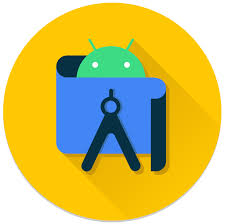

# Reporte Android 

## Brian Bautista. ☕️ 🥞

###  Curso de Android 

Entré a este curso de Android sin saber literalmente nada, lo único que sabía es que su IDE (**Android Studio**) consumía muchos recursos y te trababa la PC y sí, así era, pero al instalarlo me di cuenta que sí, te agota recursos pero no te mata la computadora, igual todo depende del equipo que tengas.

- ###  Kotlin 

Al empezar con Kotlin noté que era como programar en Java, tenía una sintaxis similar, lo cual no se me complicó mucho, incluso tener el compilador en línea hizo mucho más fácil la práctica y eso agilizó más el proceso de aprendizaje.
Lo que vimos en Kotlin fueron estructuras que hemos estado viendo desde nuestros primeros cursos de programación, por ejemplo:

- Creación de variables
- Condicionales (**if, if-else**)
- Iteraciones (**for, while**)
- Implementación de funciones.
- Colecciones:
    - **List**.
    - **Set**.
    - **Map**.

También hicimos un repaso sobre la Programación Orientada a Objetos (**POO**) dado que Kotlin depende de Java.

- ###  Android Studio 

Ver el entorno de Android Studio fue algo muy nuevo para mí, aunque debo decir que era algo parecido a NetBeans ya que genera carpetas y archivos similares para que el programa funcione de manera correcta. No obstante tenía nuevas funcionalidades, por ejemplo, el trabajar con un entorno gráfico para nuestra aplicación y desde ahí implementar código para lo que se le fuera metiendo como cajas de texto, texto simple, imágenes, botones, etc. Desde mi punto de vista algo muy práctico.

También incluye un teléfono virtual para que desde ahí se pueda ejecutar la aplicación que se ande desarrollando, sin embargo, no es algo tan recomendado a menos que se cuente con un equipo con buenos recursos en cuanto a CPU, RAM y tarjeta gráfica se refiere. De ahí es que se sugiere que se cuente con un teléfono Android conectado a la computadora para que desde ahí estemos probando nuestro proyecto y repartir así la carga de trabajo entre la computadora y el teléfono 📱

- ### Conclusiones :)

Finalmente, debo decir que fue un curso bastante genial, dado que pudimos aprender sobre la creación de apps para Android y para rematar, con la independencia que se nos dió para realizar el proyecto pudimos reforzar todo lo aprendido e investigar más cosas por nuestra cuenta. Es importante destacar que en este curso no sólo vimos Android sino también las bases de Git, un sistema de control de versiones que nos ayuda mucho a la hora de trabajar en equipo, fue la cereza en el pastel ya que Git y Github son muy importantes y son fáciles de aprender, con estas tecnologías mantenemos nuestro código organizado, con un buen historial para realizar comparaciones y mejorar nuestra programación.

