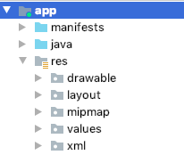
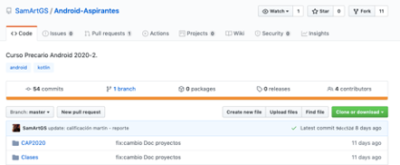

# Lo que aprendí en Android

### Creado por:

- Barreiro Valdez  Alejandro  

___

# Crear un proyecto en Android Studio

  La creación de un proyecto es sencilla ya que se tiene un botón especial para esto en el inicio. Cuando se crea un proyecto Android da la opción de elegir plantillas y la versión de Android para la cual se estará programando. Las plantillas permiten que los proyectos que se hagan puedan tener una estructura ya programada. Utilizando estas plantillas no se pierde tiempo en programar algo que ya está hecho. No sabía que las aplicaciones de Android eran programadas para ciertas versiones. También se vio la estructura general de las carpetas en un proyecto de Android. En la carpeta RES es donde se encuentra el ambiente gráfico de las aplicaciones. Los archivos que se encuentran aquí son XML. Para correr la aplicación dentro de tu celular se debe de configurar el teléfono en modo desarrollador. Después, es posible correr todas las aplicaciones que hagas dentro de tu celular, obviamente si es la versión correcta.

  Aprendí a hacer aplicaciones simples con activities y cuáles son los elementos qué debo de buscar si es que deseo de hacer alguna aplicación más compleja. Por ejemplo, se podrían usar los Google Maps en una aplicación utilizando el build.gradle entre otras cosas. Android tiene buena documentación y ya hay muchas aplicaciones y ejemplos de cómo hacer una buena aplicación. El mayor problema que se enfrenta al programar en Android es AndroidStudio. Esta IDE es muy buena pero puede llegar a ser muy tardada y se le debe de tener paciencia. 

___

# Kotlin

  De este lenguaje aprendí su gran e inusual historia sobre cómo llegó a ser utilizado por Android gracias a una demanda de Oracle. Kotlin tiene muchas facilidades como Python y sirvió mucho para introducirme al lenguaje de Python. Lo que me impactó mucho fue cómo puede ser interoperable con Java y cómo se puede programar ya sea en Java o en Kotlin. Creo que Kotlin es un lenguaje difícil porque te da muchas libertades y además no hay tanta documentación como en otros lenguajes más famosos por lo que dificulta su aprendizaje. Otra peculiaridad de este lenguaje es el null safety. Todas las facilidades que tiene Kotlin lo hacen un lenguaje muy interesante de aprender ya que facilitaría tu trabajo. Kotlin fue un lenguaje muy interesante de aprender y sí planeo seguir haciendo cosas en él.

___

# GitHub

  Este curso también fue de gran ayuda para entender Git y GitHub. Se descargaron los materiales del curso a través de un repositorio. Para clonarlos dentro de mi equipo, primero tuve que forkear el repositorio original y después clonarlo. Además, aprendí los comandos para actualizar ese repositorio y para hacer un pull request que es como sugerir un cambio en el repositorio.

  También me ayudó a aprender a trabajar en equipo para el proyecto. GitHub es una herramienta muy poderosa y útil en el mundo de los proyectos. No puedo pensar lo complicado y enredoso que sería trabajar en un proyecto computacional sin GitHub. Se tiene un control sistematizados de las versiones y se tiene control absoluto sobre lo que se hace en un proyecto. Fue interesante y útil utilizar Git y GitHub para el desarrollo de este proyecto.Además, esta plataforma es útil para desarrollar software de manera masiva y colaborativa. Creo que mucho del futuro del software está en desarrollar software de esa manera y que es importante conocer GitHub y dominarlo como si fuera cualquier otra red social.

