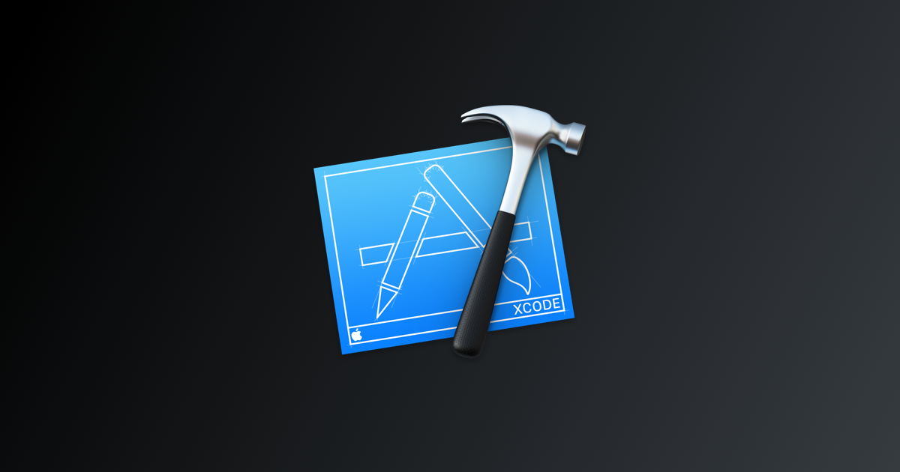
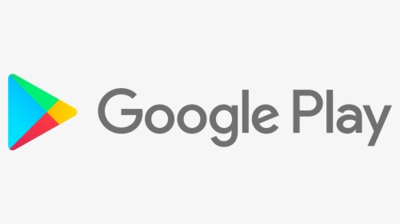
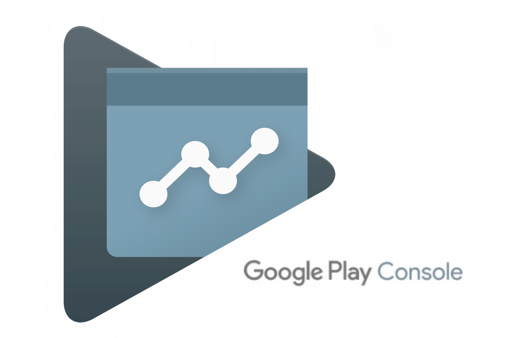

# Proceso de publicación 📢 de aplicaciones en la App Store (Apple) 🍎 y Play Store (Google) ▶️

    

## ***Objetivo***
Identificar de manera general el proceso a seguir para subir nuestras aplicaciones móviles a las dos plataformas más importantes a nivel mundial de descarga de aplicaciones 🌎.

# Publicación de aplicaciones móviles en la App Store 📱
La App Store es la única plataforma para publicación y descarga de aplicaciones móviles iOS. La página oficial de Apple México la define como: 

  

> "(...) un lugar seguro y confiable para descubrir y descargar apps. (...) un lugar innovador que te ofrece experiencias increíbles. Y para que esto sea posible, nos aseguramos de que los casi dos millones de apps disponibles cumplan con las normas de privacidad, seguridad y contenido más estrictas. Así podrás disfrutar cada app con total tranquilidad.".

  

Y no es para menos, más adelante explico por qué algunas (muchas) personas la consideran mucho más segura de malware y otros peligros que la competencia.

Para que nosotros como desarrolladores o, en muchos lados, gente de marketing podamos publicar aplicaciones en esta plataforma, Apple nos exige una serie de cosas para ser aceptados y publicados en Apple Store, las dos principales son: 
1. Estar dado de alta en el **Apple Developer Program**, esta es una plataforma de ayuda al desarrollo de aplicaciones iOS.
2. Acceso al **iTunes Connect** el cuál es un servicio vinculado al anterior donde se puede gestionar y administrar aspectos de la aplicación en la App Store.

El proceso de publicación en esta plataforma requiere mpas tiempo que en alguna otra, por ello sería muy tardado explicar todo este proceso paso a paso, así que en este documento redacto de manera general y sin enredos, el proceso a seguir para una correcta **publicación** obviando cosas como la necesidad de equipo de cómputo Apple (no obligatorio) para el desarrollo de la app y de XCode para la programación de la misma, la generación de iconos de aplicación para los diferentes tamaños en dispositivos además del ícono que pide la App Store de 1024x1024. Otro aspecto a considerar es que lanzar y mantener una app en la App Store es costoso, de inicio se requiere una membresía de 99 dolares para registrarse en el programa, cabe recalcar que en un principio desarrollar y tener una cuenta como desarrollador es totalmente gratuito pero nuestro objetivo es lanzar la app a la Store.

Apple nos ofrece una guia completa del proceso en la [App Distribution Guide](https://help.apple.com/xcode/mac/current/#/dev8b4250b57) así como la [iTunes Connect Developer Guide](https://help.apple.com/xcode/mac/current/#/dev8b4250b57).

### **Before launching** 🚀
Una vez terminada la aplicación es necesario tener o iniciar una suscripción al programa **Apple Developer Program** antes mencionado, también hablamos del costo de la misma de 99 dolares el cuál es necesario renovar cada año. La inscripción puede realizarse de inmediato y, después de confirmar y enviar toda la información requerida, solo tienes que esperar el correo electrónico de Apple que confirma la suscripción. Este registro en garantiza el acceso a iTunes Connect.

Hay dos tipos de registro: como particular y como empresa. La creación de una cuenta corporativa es un proceso que requiere mayor tiempo y requisitos extra como un número de identificación fiscal un D.U.N.S. (número de identificación de nueve cifras para empresas, comerciantes y otros operadores que están en la base de datos de Dun & Bradstreet (D&B)). Este tipo de registro permite el acceso a más de un usuario a la administración de la aplicación en iTunes Connect.

### ***Crear certificados Apple*** 📝

Estos certificados necesarios para toda aplicación se pueden generar a través de XCode o en la cuenta de desarrollador. 
Para generarlos desde la cuenta de Apple esto se realiza en (una vez iniciado sesión): "Member Center"->“Certificates, Identifiers & Profiles”->Seleccionar del menú desplegable: “iOS, tvOS, watchOS”. Para la publicación se necesitan dos certificados (development and deployment), para ello hay que seleccionar: "Certificates" y a continuación seguir los pasos:

1. Pulsar sobre "Download" en el certificado de tipo iOS distribution. Se deberá abrir para que see guarde en tu “Llavero-Keychain”.
2. Pulsar en "Idenfiers".
3. Pulsar sobre el botón + Add. Deberá introducir un nombre para el identificador y, posteriormente, el identificador (Bundle ID). Más adelante se tendrá que poner este Bundle ID en su proyecto de xCode (el código con el que se realizan la apps para el App Store).
4. Click sobre "Continue" y, por último, en "Submit".
5. "Provisioning Profiles" -> "Distribution".
6. "+ Add" y seleccionar la opción "Distribution", App Store.
7. "Continue". Y, seleccionar el Bundle ID creado en el paso anterior y nuevamente "Continue".
8. Seleccionar el certificado para iOS Distribution y "Continue". Poner un un nombre para el perfil (Provisioning) y pulsar en "Generate".
9. Por último, "Download" para descargar el provisioning y abrirlo para que se incluya en la lista de perfiles de XCode.

Otra forma más fácil de realizarlo es directamente en XCode, esta posibilidad es reciente, pues directamente en el editor podemos lanzar la aplicación y generar certificados.

  

Teniendo el proyecto abierto en XCode:

1. Ir a "Targets"->"Signing & Capabilities"
2. En la opción "Team" ver que esté la cuenta de desarrollador seleccionada o darla de alta.
3. Marcar la opción "Automatically manage signing", esta opción le dice a XCode que s eva a encargar de la generación de los cetificados.
4. Asegurarse de tener icono de aplicación en todos los tamaños.
5. Seleccionar en la parte superior un dispositivo físico o un device para proceder a generar el empaquetado de la app.
6. En la barra superior, ir a "Product"->"Archive" para empaquetar la app.
7. Una vez generado, enla ventana emergente seleccionar "Distribute App"->"App Store Connect"->"Next"->"Next"->"Next"
8. Verificar que esté seleccionado "Automatically manage signing" y pulsar "Next".
9. Hay que dejar un momento la ultima ventana y dirigirse a la App Store Connect, autenticarse, seleccionar "Mis Apps".
10. En la parte superior izquierda seleccionar  el botón "+"->"Nueva app".
11. Seleccionar las plataformas y llenar datos que se piden, verificar que el ID de pack sea correcto.
12. Regresar a XCode y seleccionar el botón "Uplodad" de la ventana que dejamos.
13. Volver a App Store Connect y llenar información de la app como nombre, idiomas, ***URL de la política de privacidad (Obligatorio)***, una vez terminado, dar clic en el botón "Guardar" de la parte superior derecha.
14. En la barra de la iquierda, seleccionar "Precio y disponibilidad", llenar datos de precio 💵, disponibilidad de países y "Guardar"
15. Seleccionar de la barra izquierda nuestra app en preparación y subir los datos necesarios, como son capturas de pantalla de la app, en este paso es recomendado elaborar propias capturas y videos para una mejor acceptación, llenar demás datos de texto y descripción de la app, palabras clave, añadir URL's de soporte, de marketing, definir el Copyright, la versión de app, clasificación de la app (definir el público al que va dirigida).
16. Añadir información de ayuda para el equipo de revisión, datos de contacto, de autenticación, etc.
17. Definir en qué momento se publicaría la app.
18. ❗️ Los pasos 13 a 17 son cruciales a la hora de mandar aplicaciones a revisión para posterior publicación en App Store, son datos que el equipo de Apple toma mucho en cuenta para revisar la app y aceptarla o no, se recomienda tener todo un equipo más allá de desarrolladores para lograr un excelente resultado.
19. En la barra superior seleccionar "Actividad" estará la versión de la app subida, su progeso, además de su estado en la App Store, aquí hay que esperar hasta que compile la aplicación.
20. Una vez termnindada la compilación, volver a "App Store"->"En preparación para el envío", allí estará una nueva sección llamada compilación y junto al nombre un botón: "+", si clicamoes en él se abrirá una ventana para añadir la o las compilaciones (versiones) que serán enviadas a revisión, seleccionar la o las deseadas, "Aceptar" y después "Guardar".
21. Se activará un botón "Enviar a revisión" ✈️ en la esquina superior derecha, dar clic en él y llenar el formulario que se pide, en él se pregunta si se tienen los derechos del contenido de la app y no usamos contenido de terceros y si la app tiene publicidad, una vez llenado, dar clic en "Enviar".

La app ya ha sido enviada a revisión por una ___persona física___ parte del equipo de apple 👍👎, el estado de la app se mostrara en la misma platadorma de Apple Store Connect además de que seríamos contactados a los datos de contacto proporcionados  ✉️.

# Publicación de aplicaciones móviles en la Play Store  📱

    

La Play Store o Google Play es la tienda de aplicaciones por excelencia para usuarios Android, este sitio alberga millones de aplicaciones de diferentes tipos y disponibles para los miles de millones de usuarios que hay en el mundo.

A compración de la App Store, Google nos ofrece una licencia mucho más económica y de ___un solo pago___ de $25 dólares 😱 para poder ser desarrollador y publicar apps en la Play Store mediante la Google Play Console, la cuál es una herramienta similar a la de Apple para poder realizar lanzamientos, monitoreo de apps y muchas más funciones.📉🔧📊

    

Una vez tengamos nuestra cuenta ya podemos mandar aplicaciones a revisión para su posterior publicación en la Play Store, lo único que hay que hacer es dirigirse a la ___"Google Play Console"___ seleccionar "Todas las aplicaciones" del menú de la izquierda y posteriormente "Crear una aplicación", el menú de la izquierda cambiará y nos colocará en la sección de "Ficha de Play Store" y a continuación seguir los pasos:

1. Selecciona un idioma predeterminado, Google selecciona automáticamente el idioma de tu cuenta. 🈵 🆎
2. Poner un título en la aplicación, éste aparecerá en la Play Store, dar click en "Crear".
3. Llenar datos de la publicación como descripción, recursos gráficos como capturas de pantalla (por lo menos 2 por dispositivo), videos, íconos, etc.
4. Categorización y fórmulario, en esta parte es importante dar una clasificación a la aplicación en base a su contenido y lo que muestra a los usuarios. Se selecciona el tipo de app y su categoría además de la necesidad de contestar un cuestionario para que Google le dé un certificado de clasificación, esto para definir el público al que va dirigido, cabe resaltar que por cada versión nueva se tiene que contestar este cuestionario. ©️❌❗️ ✅
5. Llenar apartado de contacto para darle a Google una manera de comunicarse con nosotros 📞.
6. Añadir link de sitio de políticas de privacidad, esta parte a diferencia de la App Store es opcional.

En el menú izquierdo ir a la sección de Precios y distribución 💲, aquí hay que seleccionar si la aplicación serpa de pago o gratuita, en caso de seleccioanr "Gratis" esta selección no podrá cambiar. Además, hay que definir los países donde estará disponible 🌎, si está dirigida para niños, si contiene anuncios, categorias de dispositivos, programas de usuarios, y consentimiento, cada parte es importante detenerse a leer a qué se refiere y dependerá del propósito de la aplicación el seleccionar opciones o no 👀.

En el mismo menú de la izquierda se pueden elegir más opciones para la aplicación las cuales son eso, opcionales, pero las más importantes son las que ya mencioné y para decirle a Google cuál es nuestra aplicación nos tenemos que dirigir a la sección de "Versiones de la app":
1. En esta parte mostrará varias "pistas" las cuales son opciones para subir versiones alfa, beta, etc, si ya es la versión final hay que seleccionar de la "Pista en producción" el botón de "Administrar" y a continuación en "Crear Versión".
2. Click en "Continuar" y ahora, a diferencia de Apple Store donde se linkeaba desde XCode, aquí nos pedirá subir directamente al sitio desde nuestro equió el archivo "APK", para esta parte es importante que desde ___Android Studio___ a la hora de haber creado el APK, se haya seleccionado de las "Signature Versions" las "V1(Jar Signature)" y la "V2(Full APK Signature").
3. Una vez subido el APK hay que poner nombre a la versión y novedades de la actualización, ya que este s el mismo proceso para cuando se actualiza una app.
4. Ya que se haya llenado todo dar click en "Revisar" para que el equipo de la Play Store revise la aplicación y al cabo de unas horas pueda estar lanzada 🚀.

### Google menciona lo siguiente: 
### Centro de Políticas de Desarrolladores 

Propiedad intelectual

No admitimos aplicaciones ni cuentas de desarrolladores que vulneren los derechos de propiedad intelectual de terceros, incluidos secretos comerciales, patentes, marcas, derechos de autor y otros derechos de propiedad. Tampoco admitimos aplicaciones que animen o induzcan a infringir derechos de propiedad intelectual.

Responderemos a las notificaciones claras de infracción de los derechos de autor. Para obtener más información al respecto o presentar una solicitud basada en la DMCA, consulta los procedimientos relacionados con los derechos de autor.

Para presentar una reclamación por la venta o promoción de productos falsificados en una aplicación, envía un aviso de falsificación.

Si eres el propietario de una marca comercial y crees que una aplicación de Google Play infringe tus derechos, te animamos a que te pongas en contacto directamente con el desarrollador para resolver el asunto. Si no llegáis a un acuerdo, envíanos una reclamación de marca comercial a través de este formulario.

Si tienes información por escrito que demuestre que puedes utilizar la propiedad intelectual de un tercero en tu aplicación o ficha de Play Store (p. ej., nombres de marcas, logotipos o recursos gráficos), ponte en contacto con el equipo de Google Play antes de enviar el contenido para garantizar que tu aplicación no se rechace por infringir la propiedad intelectual.

## Referencias:

* https://developer.android.com/guide
* https://help.apple.com/xcode/mac/current/#/dev8b4250b57
* https://www.youtube.com/watch?v=tg6YcD52jNA
* https://www.youtube.com/watch?v=EOkKc1Oc92M
* https://www.ionos.mx/digitalguide/paginas-web/desarrollo-web/publicar-una-app-en-la-apple-store-crear-una-app/