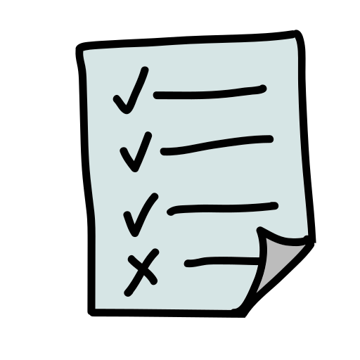

# **Proceso de publicación de una aplicación en App Store y Play Store**

```shell
Ailyn Merino Hernández
```

## App Store 


<br>Para llevar a cabo la publicación de una aplicación en la tienda de Apple es indispensable cumplir con los siguientes requerimientos:


**1. Licencia** 
Formar parte de la comunidad de desarrolladores Apple y obtener una licencia. Actualmente se cuentan con cuatro tipo de licencias. 

| Tipo de Licencia | Descripción  | Costo |
| :------------ |:---------------:| -----:|
| WebSite      | Registro en la web de Apple | Gratis |
| University Programs     | Exclusivo para Universidades que se encuentren en el programa|  Gratis|
| Developer program |Incluye herramientas betas adicionales |USD 99 al año |
| Enterprise  |Orientada a aplicaciones corporativas privadas | USD 299|

**2. Aprobar la revisión de la App Store:**
Apple cuenta con una serie de pautas con las que debe cumplir la aplicación antes del lanzamiento. 
- **Seguridad:** El contenido de la aplicación no debe ser ofensivo, molesto, ni causar algún tipo de daño al dispositivo de los usuarios.
- **Desempeño:** Deben ser versiones finales con todos los metadatos necesarios y URL completamente funcionales incluidas. Apple rechaza los paquetes de aplicaciones incompletos y los binarios que se bloqueen o presenten problemas técnicos.
- **Negocio:** El modelo de negocio tiene que ser claro y estar incluido en los metadatos.
- **Diseño:** Enfatiza en la originalidad del producto así como la funcionalidad y las actualizaciones. También incluye una serie de estándares de diseño que los desarrolladores deben considerar.
- **Legal:**  Las aplicaciones deben cumplir tanto las pautas legales de Apple como las leyes locales. 

*Para más información, consultar:* [App Store Review Guidelines](https://developer.apple.com/app-store/review/guidelines/#legal "App Store Review Guidelines")

**3. iTunes Connect**
Realizar registro en  iTunes Connect. Consiste en un conjunto de herramientas basadas en web para enviar y administrar aplicaciones.

**4. Configuración de aplicaciones para la distribución**
Se requiere contar con un ícono, vista previa y metadatos.

**ícono -** Medidas correspondientes para cada dispositivo Apple

**vista previa -** Comunica la experiencia de usuario

**Los metadatos incluyen:**
- Nombre de la aplicación
- El número de versión
- Categoría de la aplicación
- Descripción detallada
- Cualquier palabra clave adicional

Finalmente se archiva la app, se carga en iTunes Connect y se ejecute para la aprobación de App Store.


### Etapa de publicación 
---

Una vez cumplido los cuatro requisitos anteriores, procedemos a registrar a la organización responsable del mantenimiento de la aplicación en Xcode para después registrar los accesos.

Posteriormente creamos un Bundle identifier asociado a la app y lo damos de alta.

Se necesitan de credenciales y certificados para firmar la aplicación. Esta herramienta permite validar a la aplicación y a la organización desarrolladora.

Cuando se tengan los certificados  y el Bunfle indentifier, debe crearse una perfil de aprovisionamiento. Esto se refiere a la combinación del ID y los certificados que perimitirán la ejecución futura de la aplicación en la App Store. 

La aplicación tiene que estar dada de alta en iTunes Connect. Cuando se inicia sesión, en la sección de "Mis apps" se carga la app y se agrega la información que será publicada en la tienda.

Como paso final, compilar el binario de la aplicación en Xcode y subirlo a App Store. Para esto hay que verificar los datos de los certificados y el Bundle ID.

---
## Play Store 

Al igual que en App Store, la publicación de aplicaciones en Play Store consta de dos etapas:
- [x] Configuración de la app para el lanzamiento
- [x] Lanzamiento de la app para los usuarios

Requesitos 

**1. Crear cuenta para desarrollador Google.**
Para poder subir su aplicación a la tienda de google se debe contsr con una cuenta de desarrollador, la cual implica un único costo de $25.

**2. Cuenta de comerciante.**
En caso de planear vender el producto, se recomienda crear una cuenta de comerciante que se vinculará automáticamente con la cuenta de desarrollador.

**3. Legalidad.**
Preparar el acuerdo legal entre el comerciante y el usuario. Estos documentos detallan qué puede hacer el usuario con el producto, tarifas de licencia, información de propiedad intelectual, políticas de privacidad, etre otros acuerdos.

**4. Políticas Google.**
Asegurar que la app no viole las políticas de Google, que se pueden consultar en [Centro de Políticas para Desarrolladores](https://play.google.com/about/developer-content-policy/ "Centro de Políticas para Desarrolladores")

**5. Requisitos técnicos.**
La aplicación debe contar con:
- Un Identificador que no podrá ser cambiado después de su distribución.
- Certificado y firma para la aplicación. Esto permite identificar al autor del producto.
- Verificación de la versión de android que establece Google
- Formato de archivo, ya sea .apk o .aab

###  **Etapa de publicación** 

Al cumplir con los lineamientos de los requisitos, agregamos una nueva aplicación a la cuenta de desarrollador y agregamos información acerca de la app.

El paso soguiente es la creación de la ficha de Play Store, en donde agregaremos una descripción detallada sobre cómo funciona la app, la visualización previa con capturas de pantalla, video promocional en caso de tener uno, ícono de la aplicación, etiquetas, categorización, localización, políticas de privacidad y detalles de contacto. 

Google aplica un cuestionario de calificación, que en caso de no ser contestado puede implicar la eliminación de la app.

Es importante añadir detalles acerca del precio, en caso de tener un costo y formas de pago que se puedan aplicar. 

En la sección de Lanzamiento de aplicaciones hay dos opciones para publicar: alpha o beta.
La opción alpha significa que sólo un grupo seleccionado por la organización podrá probar la aplicación, mientras que el lanzamiento beta es para que todos puedan utilizar la app y puedan enviar comentarios acerca de ésta. Para concluir, cargamos los archivos de aplicación.